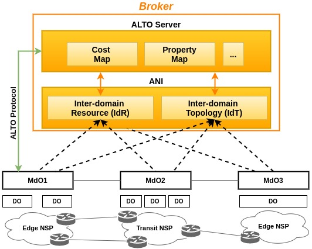
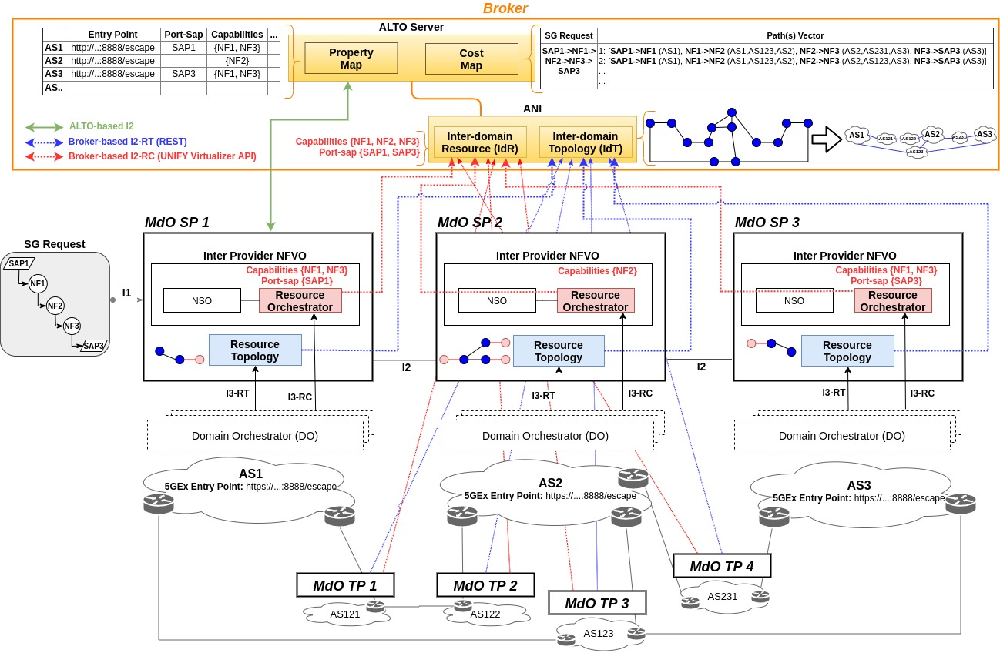

# Broker-assisted Multi-domain Network Service Orchestration

## 1. Abstract

  Future 5G  scenarios call for service orchestration models beyond the achievements of ETSI MANO. Complex multi-vendor, heterogeneous technology and resource environments require elaborated collaboration mechanisms between different network operators. In this work, we present a broker-plane approach on top of per-domain management and orchestration functions to coordinate the delivery of a multi-operator End-to-End Network Service (E2ENS) that combines per-domain paths and network functions for a given service request. In our prototype implementation, a broker retrieves local information about topology and resources from each Multi-domain Orchestrator (MdO) to offer after added value services in the form of abstract Map Services. These map abstractions are easily consumable through developer-friendly REST APIs based on the Application-Layer Traffic Optimization (ALTO) standard protocol[1].

## 2. Architecture

As shown in Figure 1, a set of  Domain Orchestrators (DOs) responsible for various resource domains (featuring physical and virtual, software and hardware components) is assumed to be managed by a MdO. The broker layer is conceived to be working as a coordinator between a set of MdOs.


*Figure 1: Broker-assisted Multi-operator Network Architecture*

The main architectural components are described next:

- **Inter-domain Resource (IdR):** It creates a hierarchical database that contains inter-domain resource information such as resource availability (i.e., CPU, memory, and storage), virtual/physical Network Functions (NFs) supported and Service Access Points (SAPs) to access those resource. UNIFY [1], TOSCA [2], among other data models can be used to define the interface between IdR and MdOs.

- **Inter-domain Topology (IdT):** A hierarchical TED (Traffic Engineering Database) that contains inter-domain network topology information, including additional key parameters (e.g., MdO entry point). This information can be retrieved from each MdO through BGP-LS or REST interfaces.

- **Map Service:** This component is the core of the Broker layer. The information collected from the IdR and IdT modules are processed here to provide abstract maps with a simplified view, yet enough information about MdOs involved in the federation. The goals of the Map Service is to convey: *(i)* a set of properties (e.g. SAPs, NFs, IT resources, etc.) for MdOs in the federation (*Property Map*), *(ii)* domain-level topology (*Topology Map*), and *(iii)* path costs for an E2ENS request (*Cost Map*). All these maps are provided through a common transport and encoding protocol as defined in ALTO  based on existing HTTP technologies (RESTful and JSON).

## 3. Proof of Concept Use Case Implementation

The strawman use case scenario refers to an E2E service orchestration involving seven different administrative domains (3 Service Providers (SPs) and 4 Transit Providers (TPs)), as shown in Figure 2. Next, we provide information about the implementation choices and prototype details such as the MdO components, the Neo4j graph-based database used as the back-end for the ALTO information, and the OpenDaylight (ODL) controller used as ALTO server

### 3.1 MdO Components: 5GEx Project

The MdO functional components and interfaces follow the 5G Exchange (5GEx) project architectural proposal[2]. Each administrative domain has an MdO to manage resource and/or service orchestration at multi-operator level (via interface I2 APIs). Within the same administrative domain, each MdO uses emulated DOs (e.g., SDN, Mininet, Openstack, etc.) with emulated I3 interfaces, since no data-plane is present, i.e., DOs use static configuration files to load local information about topology (I3-RT) and resources (I3-RC).

The different MdO components are based on existing open source software tools, for example, ESCAPE and Netphony-topology are used as Resource Orchestrator and Resource Topology, respectively. ESCAPE (Extensible Service ChAin Prototyping Environment)[3] is a framework which supports the development of several parts of the service chaining architecture (e.g., VNF implementation, traffic steering, virtual network embedding, etc.) and it also includes a simple service layer interacting with clients. Netphony-topology[4] is Java-based TED working as a BGP-LS Speaker that contains a Topology Module with a collection of TEDs and plugins to export and import the TEDs. Besides, MdOs expose I1 interfaces to the tenants who request services and/or slices which should follow a Network Function Forwarding Graph (NFFG) format.

### 3.2 Broker Components

In case of the broker layer, the IdR and IdT components use the UNIFY Virtualizer API[5] (broker-based I2-RC API) and REST API (broker-based I2-RT API) respectively, to create the hierarchical databases. From the interdomain information are created the two different ALTO Map Services: (i) Property Map and (ii) Cost Map.

- The **Property Map** includes property values grouped by Autonomous System (AS). Such values are SAPs, NFs, and the 5GEx Entry Point (e.g., the URL of the ESCAPE orchestrator).

- The **Cost Map** defines a path vector as an array of ASes, representing
the AS-level topological distance between entities (i.e., AS→AS, SAP→SAP, NF→NF or SAP↔NF). Moreover, as described in ALTO the Multi-Cost Map [31], path vector constraints can be applied to restricts the response to costs that satisfy a list of simple predicates (e.g., =, >, <, >, 6). Moreover, it is possible to use a special “shortest” predicate provide the shortest path between entities.

When an MdO receives a Service Graph (SG) request, it uses the ALTO server (through ALTO-based I2 APIs) to determine the underlying network graph and a potential set of paths before bilateral negotiation between MdOs is started

### 3.3 Back-end/Front-end Servers

The resulting data for each broker component (IdR, IdT and ALTO server) is stored in Neo4j graph-based database (Back-end Server)[6]. We opt for this property graph4
since it provides a natural modeling approach and it uses a key-value store abstraction for JSON object coding. Neo4j is an open-source non-relational graph database implemented in Java, and it supports true ACID transactions, high availability, and scales to billions of nodes and relationships [neo4jManual]. Moreover, its native traversal query language such as Cypher highly facilitates the development of applications.

The ALTO web server (Front-end Server) has been derived from the ALTO OpenDaylight (ODL) framework. The current release of ALTO[7] in ODL includes, among other modules, ALTO Northbound providing basic ALTO services as RESTful web services (Northbound APIs) for ALTO client/server communications. ALTO Northbound APIs generate ALTO services from data stored in the MD-SAL data store (an ODL core component). For our implementation, it was necessary to modify the Northbound APIs to generate ALTO services from the data stored in the Neo4j back-end and converts it into the ALTO format specification.


*Figure 2: Broker-assisted 5GEx Info Exchange*

### 3.1 Environment Setup

#### 3.1.1 Requirements
- Operating System
  - Ubuntu 14.04/16.04 LTS  
- Docker Community Edition
  - https://docs.docker.com/engine/installation/linux/ubuntu
- Docker Compose 1.13.0
  - https://github.com/docker/compose/releases
  - Install Compose as a superuser (Run `sudo -i`)
- Postman Rest Client
  - For Linux x64: https://app.getpostman.com/app/download/linux64
  - More Information: https://www.getpostman.com/apps
- Hardware
  - Disk space: from 10 GB
  - RAM: from 2GB

#### 3.1.2 Installation
```sh
$ git clone https://intrig.dca.fee.unicamp.br:8865/intrig-unicamp/alto-based-broker-assisted-mdo
$ cd alto-based-broker-assisted-mdo
$ util/install.sh
```

The main tasks of the `install.sh` script are:
- Create autoexecutable jars with all dependencies included to run the alto-aggregator module, the alto module and the netphony-topology module as standalone applications.  
- Clone the Escape module and install all necessary packages. Subsequently, two files are modified:
  - `adapters.py` (BGPLSRESTAdapter class): Change REST API name: ‘virtualizer’ -> ‘topologyFromALTO’
  - `escape-bgp-ls-test.config` (BGPLSRESTAdapter class): Change Remote URL: http://localhost:8087 -> http://172.25.0.20:8088

### 3.2. Run Scenario

#### 3.2.1 Start and run the entire environment
```sh
~/alto-based-broker-assisted-mdo $ cd docker-compose/test3/
$ sudo docker-compose up
```

#### 3.2.2 List Containers (in other terminal)
```sh
~/alto-based-broker-assisted-mdo/docker-compose/test3
$ sudo docker-compose ps
```

```sh
Name                                        Command               State            Ports             
--------------------------------------------------------------------------------------------------------
test3_inter-domain-resource_1   ./wait-for-it.sh 172.28.0. ...   Up                                  
test3_inter-domain-topo_1       ./target/wait-for-it.sh 17 ...   Up      8088/tcp                    
test3_map-service_1             ./target/wait-for-it.sh 17 ...   Up      8181/tcp                    
test3_neo4j_1                   /docker-entrypoint.sh neo4j      Up      7473/tcp, 7474/tcp, 7687/tcp
test3_ro-escape-td121_1         python escape.py --debug - ...   Up      8008/tcp, 8888/tcp          
test3_ro-escape-td122_1         python escape.py --debug - ...   Up      8008/tcp, 8888/tcp          
test3_ro-escape-td123_1         python escape.py --debug - ...   Up      8008/tcp, 8888/tcp          
test3_ro-escape-td231_1         python escape.py --debug - ...   Up      8008/tcp, 8888/tcp          
test3_ro-escape1_1              python escape.py --debug - ...   Up      8008/tcp, 8888/tcp          
test3_ro-escape2_1              python escape.py --debug - ...   Up      8008/tcp, 8888/tcp          
test3_ro-escape3_1              python escape.py --debug - ...   Up      8008/tcp, 8888/tcp          
test3_tads-td121_1              java -Dlog4j.configuration ...   Up      8088/tcp                    
test3_tads-td122_1              java -Dlog4j.configuration ...   Up      8088/tcp                    
test3_tads-td123_1              java -Dlog4j.configuration ...   Up      8088/tcp                    
test3_tads-td231_1              java -Dlog4j.configuration ...   Up      8088/tcp                    
test3_tads1_1                   java -Dlog4j.configuration ...   Up      8088/tcp                    
test3_tads2_1                   java -Dlog4j.configuration ...   Up      8088/tcp                    
test3_tads3_1                   java -Dlog4j.configuration ...   Up      8088/tcp                    
test3_topology-map_1            ./target/wait-for-it.sh 17 ...   Up                                  
```
### 3.3 REST API Examples

The initial evaluation for our testing environment includes the
function behavior. This means that we evaluate whether our ALTO server delivers ALTO services in compliance with ALTO base services defined in RFC7285 [1], e.g., Network Map, Cost Map and ALTO extension services: (i)Property Map [8] and (ii) Path Vector [9]. For that purpose, we used a REST client tool6 to retrieve ALTO information in JSON format, communicating with the ALTO server via HTTP request.

#### 3.3.1 Inter-domain Topology (IdT) Module

In the “BrokerAssisted5GEx” Postman collection, select “Inter-domain” and execute:
- **Inter-domain Topology:** Request the hierarchical TED information in UNIFY format. It includes (among others):
  - Local 5GEx entry point (unify-slor key).
  - IPv4 network prefix: (reachability_ipv4_address key)
  - IPv4 network mask: (reachability_prefix key)
  - Inter- and Intra- links.


- Notes:
  - The hierarchical TED information is created from Intra-domain TED information in the Resource Topology module (Netphony-topology) in each MdO.
  - The Inter-domain Resource module uses the 5GEx entry points to retrieve the resource view from each ESCAPE resource orchestrator.

#### 3.3.2 Inter-domain Resource (IdR) Module
- Using the  the Neo4j browser (http://172.28.0.30:7474), execute the next cypher query:

```sh
MATCH (n)
WHERE labels(n) in ['DOMAIN', 'Node', 'Port', 'NF']
OPTIONAL MATCH (n)-[r]-()
RETURN n,r
```

- Notes:
  - This module gets a Virtualizer object with defined operations and put it inside neo4j.
  - This module was adapted from virt-neo4j API (https://213.16.101.140/raphael.vicente.rosa/virt-neo4j)

#### 3.3.3 Map Service Module: Topology Map
- Using the  the Neo4j browser (http://172.28.0.30:7474), execute the next cypher query:
```sh
MATCH (n)
WHERE labels(n) in ['AS']
OPTIONAL MATCH (n)-[r]-()
RETURN n,r
```
- Notes:
  - This module creates/stores an AS-level connectivity graph from the information in the IdT component.

#### 3.3.4 Map Service Module: Property Map
  - In the “BrokerAssisted5GEx” Postman collection, select “Map Services/PropertyMap” and execute:

    - **Property Map:** Request property values grouped by AS. Such values include SAPs, VNFs supported and the 5GEx Entry Point (e.g., the URL of the ESCAPE).
    - **FilterPropertyMap:** Request a subset of a full Property Map. For example, a MdO may supply a list of PIDs to be included (e.g. List of ASes).

#### 3.3.5 Map Service Module: Cost Map

##### 3.3.5.1 Cost Map 1

  - The Cost Map defines a path vector as an array of ASes, representing the AS-level topological distance between entities (i.e., AS→AS, SAP→SAP, NF→NF or SAP↔NF).
  - Path vector constraints can by applied to restricts the response to costs that satisfy a list of simple predicates (e.g., =, >, <, ≥, ≤).
  - A special “shortest” predicate can be used to provider the shortest path between entities.
  - In the “BrokerAssisted5GEx” Postman collection, select “Map Services/CostMap” and execute:
    - **CostMap:** Filtered CostMap (src AS ->dst AS)
    - **CostMapCon:** Filtered CostMap with constraints [">= 3", "<=4"] .
    - **CostMapCon2:** Filtered CostMap with constraints [ "shortest"].

##### 3.3.5.2 Cost Map 2

  - The Cost Map request can include a Service Graph in NFFG format.
  - In the “BrokerAssisted5GEx” Postman collection, select “Map Services/CostMapSG” and execute:
    - **CostMapSG:** Request the AS-level topological distance for a given SG request.

##### 3.3.5.3 Cost Map 3

  - Cost Map with constraints
  - In the “BrokerAssisted5GEx” Postman collection, select “Map Services/CostMapSG” and execute:
    - **CostMapSGCon:** Request the AS-level topological distance for a given SG request with constraints [ "= 5"].

##### 3.3.5.4 Cost Map 4

  - Cost Map with constraints
  - In the “BrokerAssisted5GEx” Postman collection, select “Map Services/CostMapSG” and execute:
    - **CostMapSGCon:** Request the AS-level topological distance for a given SG request with constraints [ "shortest"].

## 7. References

  [1] RFC 7285: Application-Layer Traffic Optimization (ALTO) Protocol

  [2] http://www.5gex.eu/wp/?page_id=510

  [3] https://github.com/5GExchange/escape

  [4] https://github.com/telefonicaid/netphony-topology

  [5] https://www.eict.de/fileadmin/redakteure/Projekte/Unify/Deliverables/UNIFY-D3.2a-Network_Function_Forwarding_Graph_specification.pdf

  [6] https://neo4j.com/

  [7] https://wiki.opendaylight.org/view/ALTO:Main

  [8] http://www.ietf.org/internet-drafts/draft-ietf-alto-unifiedprops-new-03.txt.

  [9] http://www.ietf.org/internet-drafts/draft-ietf-alto-path-vector-03.txt
